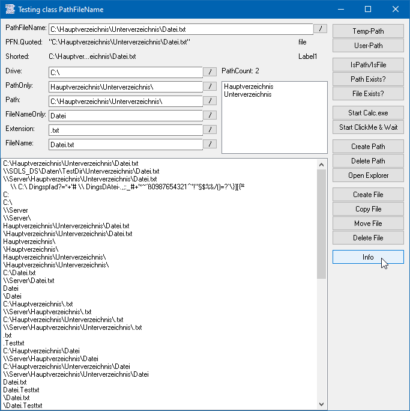

# IO_PathFileName
## one class for every function you can imagine on path, filename and files    

[]

The functions in this class went with me like forever, like for the very first beginning maybe around february 1998.  
Of course the functions have constantly changed over time. In former times the class actually consisted of 3 classes:  
PathFileName, PFNStream, PFNProg where PFNStream and PFNProg wrapped PathFileName like in a decorator-pattern.  
If you know a function you need on files, that is not included in the class, let me know or start an issue.  
When I was first digging into the dotnet-Fx in 2003 I was very confused why there is not such a class contained.  
Instead there are some classes doing similar things, making the framework bloated, and cofusing the programmer.  

The class PathFileName assumes that every pathfilename consists of the following parts:  
- Path  
    + Drive / servername  
	+ PathOnly  
- Filename  
    + FileNameOnly  
    + Extension  
  
You can use the following functions on it:  
* Check if file exists  
* Check if path exists  
* Copy a file  
* Move a file  
* Rename a file  
* Delete a file  
* Create a full path  
* Delete a path  
* Validate path and filename by removing illegal letters (like "?")  
* Add double quotes   
* Extract/read every part of the path like in an array  
* Change/write every part of the path like in an array  
* Open for input/output and close after it automatically  
* Write Strings to a text-file  
* Read Strings from a text-file  
* Start the executable or the program associated to the file  
* Start asynchron and synchron by waiting for it to return  
* Get TempPath  
* Get UserPath  
* Get file attributes  
* Get path attributes  
* Create a shorted string of x chars to use in history-lists  
* Get a pointer to a string-buffer to use it in WinAPI-functions  
* Uses mostly VB-functions and as less WinAPI-functions as needed  
* Works in VBC, VBA, VBA7, x86 and x64  
* due to the fact that the class uses all VB syntaxes, all pathfilenames will be used in Ansi when opening files for read- or write-operations.  
* Unicode is supported of course for the file content  

